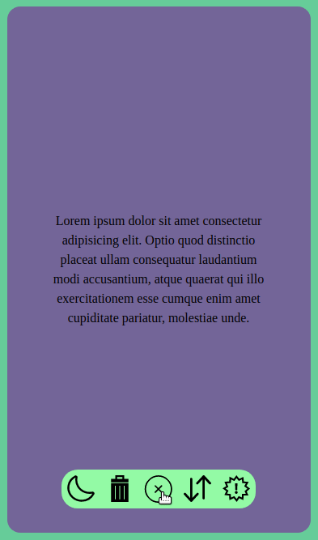

# Rudder navigation bar

A small demo of the rudder style navigation bars, often found on mobiles. Made with JS. The `rudder()` function expects an id for the main button in the rudder. The rudder is then expanded and the axis buttons next to it are hidden.

# Demo

